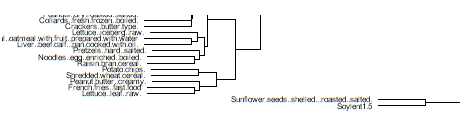
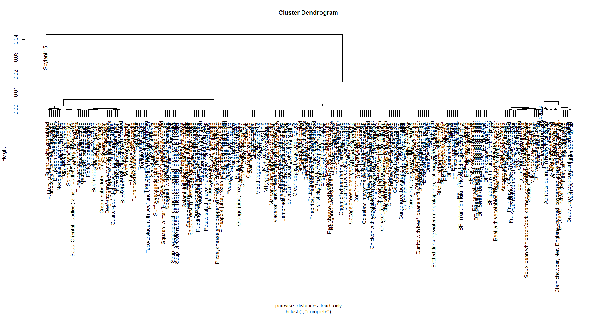

Is eating Soylent 1.5 for every meal more dangerous than eating normal foods, in terms of lead and cadmium exposure? This is an analysis I ran a few years ago to answer that question for myself. I've refactored a couple bits that were unreadable (mostly by adding Tidyverse), but this remains a pretty simple analysis.

#Background:
You've probably heard of Soylent. A few years back, I was eating a lot of Soylent 1.5.
It came out that 1.5 [had lead and cadmium levels above California thresholds.](https://www.eater.com/2015/8/16/9162301/soylent-as-you-sow-cadmium-lead-california)

Now, I knew California has some overly cautious laws, so I initially wasn't that concerned.

Then I read [Rosa Labs (Soylent's manufacturer's) response](https://faq.soylent.com/hc/en-us/articles/204197379-California-Proposition-65) It seemed obvious to me that the meals they cited as a comparison - heavy on fish - were unlikely to be comparable to the metal levels in what people normally eat. So I decided to investigate.

The FDA Total Diet Study provides samples of element levels in all kinds of foods. I decided to aggregate the average lead and cadmium levels in different foods, and compare these averages to the levels Rosa Labs reported in Soylent 1.5.

```{r}
#Get data
download.file("http://www.fda.gov/downloads/Food/FoodScienceResearch/TotalDietStudy/UCM455198.zip", destfile="./yearstandards.zip")

stds <- read.table(unz("yearstandards.zip", "Elements 2011.txt"), header=TRUE, sep="\t")

#Focus on only the rows containing lead or cadmium
leadandcad <- subset(stds, Element=="CADMIUM" | Element=="LEAD")

#Check whether any entries are in micrograms rather than milligrams
grep("ug/kg", leadandcad$Unit)
#None are, so don't need to adjust concentrations
```

#Plan
My original analysis plan was to compare a 3-soylent-meal day to 3 "normal" meals constructed from other 
foods. Use hierarchical clustering to see if 3 Soylent meals 1.5 naturally "falls in the same category" as a lot of other meals, or whether it's an outlier. Key question is qualitative - whether soylent 3x per day has comparable content to other foods. Whether it's in the same cluster as a bunch of others, or in a cluster of its own.

I laid out a plan to run the following analyses:
-Single meal, lead
-Single meal, cad
-3 meals mean, lead
-3 meals mean, cad
-3 meals median, lead
-3 meals median, cad
and use a Bonferroni correction for multiple comparisons.

I abandoned that analysis plan because it was obvious from the one-meal results that the rest weren't necessary.


```{r}
#First, I prep 3 datasets for hierarchical clustering: one for just lead, one for just cadmium, and one for both lead AND cadmium levels.

#Variables I care about: Food.No, Food.Name, Element, Conc
averaged <- aggregate(Conc ~ Food.Name + Element, leadandcad, mean)

#Add a row for Soylent 1.5.
#Manually add in lead/ cad levels from here: 
#https://faq.soylent.com/hc/en-us/article_attachments/203065059/prop-65-meals.v2.rev_D.jpg

#Make data frame for Soylent using Rosa Labs concentrations from #https://docs.google.com/spreadsheets/d/1xS8bAQKZoksJfONrEb1N_kFD5Sp-0W-TOJBOJQyLJk8/edit#gid=0

Food.Name <- c("Soylent1.5", "Soylent1.5", "Soylent2.0", "Soylent2.0")
Element <- c("CADMIUM", "LEAD", "CADMIUM", "LEAD")
Conc <- c(0.186, 0.043, 0.010, 0.005)
soyframe <- data.frame(Food.Name, Element, Conc)

averaged <- rbind(averaged, soyframe)

#Split a lead-specific and a cadmium-specific dataset out of the overall data frames.
leadset <- averaged[averaged$Element=="LEAD",]
cadset <- averaged[averaged$Element=="CADMIUM",]

#Simplify these sets into just food name and concentration
simpleleadset <- leadset[,3]
names(simpleleadset) <- leadset$Food.Name

simplecadset <- cadset[,3]
names(simplecadset) <- cadset$Food.Name

#Reshape averaged into having lead conc in one column and cadmium conc in another, and use them as x and y
library(tidyverse)
data_for_hclust <- averaged %>% spread(key=Element, value=Conc)
row.names(data_for_hclust) <- make.names(data_for_hclust[,1])
#Accidentally added names as a column so let's fix that.
data_for_hclust <- data_for_hclust[,-1]
```

Time for clustering!
```{r}
#Now take pairwise distances
pairwise_distances <- dist(data_for_hclust)
hclustering <- hclust(pairwise_distances)
lead_cad_pairwise_distance_clusters <- plot(hclustering, cex=0.5)
```


Holy shit is there an outlier.




That's Soylent 1.5 and sunflower seeds. Their mean lead-and-cadmium levels are very different from the levels in other foods.

What about lead alone?
```{r}
pairwise_distances_lead_only <- dist(simpleleadset)
hclustering_lead_only <- hclust(pairwise_distances_lead_only)
plot(hclustering_lead_only)
```



#WELP

```{r}
#And cadmium alone?
pairwise_distances_cad_only <- dist(simplecadset)
hclustering_cad_only <- hclust(pairwise_distances_cad_only)
plot(hclustering_cad_only, cex=0.5)
```

Looks the same as the first plot, of lead and cadmium combined. Soylent 1.5 and sunflower seeds are in the same cluster, above every other food.

#Is it worse than the worst case for other foods?

So, the average case was not looking good for soylent. Breaking from my initial plan, I decided to also look at the max, rather than median, levels of lead and cadmium found in foods?

```{r}
max <- aggregate(Conc ~ Food.Name + Element, leadandcad, FUN=max)
max <- rbind(max, soyframe)

maxleadset <- max[max$Element=="LEAD",]
maxcadset <- max[max$Element=="CADMIUM",]

#Simplify these sets into just food name and concentration
simplemaxleadset <- maxleadset[,3]
names(simplemaxleadset) <- maxleadset$Food.Name

simplemaxcadset <- maxcadset[,3]
names(simplemaxcadset) <- maxcadset$Food.Name

max_data_for_hclust <- max %>% spread(key=Element, value=Conc)
row.names(max_data_for_hclust) <- make.names(max_data_for_hclust[,1])
max_data_for_hclust <- max_data_for_hclust[,-1]

max_pairwise_distances <- dist(max_data_for_hclust)
max_hclustering <- hclust(max_pairwise_distances)
max_lead_cad_pairwise_distance_clusters <- plot(max_hclustering, cex=0.5)
```

Here Soylent 1.5 is no longer in the highest cluster with sunflower seeds... but it's still an outgroup to everything _except_ sunflower seeds

```{r}
pairwise_distances_max_lead_only <- dist(simplemaxleadset)
hclustering_max_lead_only <- hclust(pairwise_distances_max_lead_only)
plot(hclustering_max_lead_only)
```

Still outlier, though closer to things like raw avocado and canned fruit.

```{r}
pairwise_distances_max_cad_only <- dist(simplemaxcadset)
hclustering_max_cad_only <- hclust(pairwise_distances_max_cad_only)
plot(hclustering_max_cad_only, cex=0.5)
```

Potato chips and boiled spinach maximums are also bad on cadmium, but Soylent 1.5 is still far from normal.


#Will it hurt me?
Now, I decided three-meal analysis is beside the point. Nothing but an all-sunflower-seed diet would match an all-Soylent-1.5 diet on lead and cadmium levels.

But lots of foods have high-sounding levels of things that are ultimately below the threshold to do harm. _(There's more recent evidence there's no lower threshold for lead, but I didn't know that at the time)._ The key question is: will it hurt you? 

Find out mass of 3 soylent 1.5 powder meals per day, multiply by concentration, see if it takes you over the daily limit.

```{r}
#files.soylent.com/pdf/soylent-nutrition-facts.pdf
#115 grams per serving, 4 servings per pouch.
#460 grams per day -> 0.46 kg

#Cadmium intake per day 
0.46*max_data_for_hclust[272,1]
#That's 0.08556 mg

#Lead:
0.46*max_data_for_hclust[272,2]
#That's 0.01978 mg

##FDA limits:
#Limits for solid food - lead 6 ppm, liquid food 1 ppm
#Cadmium - 0.1 ppm for "cereals and vegetables"
#The Prop 65 safe harbor level for lead is 0.5 micrograms per day. 60x lower than avg exposure EPA permits in drinking water -> amount they found in Soylent was 1/5 to 1/2 lower than what EPA permits in drinking water

#mg/kg converts 1:1 to ppm, as you can see through dimensional analysis.
```

So, lead concentration is 1/2 what FDA allows in liquid food, and is well over the (more cautious) Prop 65 safe harbor level.

The cadmium level is higher than the FDA cereals-and-vegetables limit, and if liquid makes it more bioavailable that is a real problem. That scared me more than the lead.

That's why I stopped eating Soylent 1.5. I never tried 2.0 because I found the powder more convenient than keeping bottles of liquid around - and also the early on stories of people finding mold in 2.0. I've since gotten into cooking rather than trying to live on meal replacements, but if you have a trustworthy sort-of-food feel free to tell me about it.